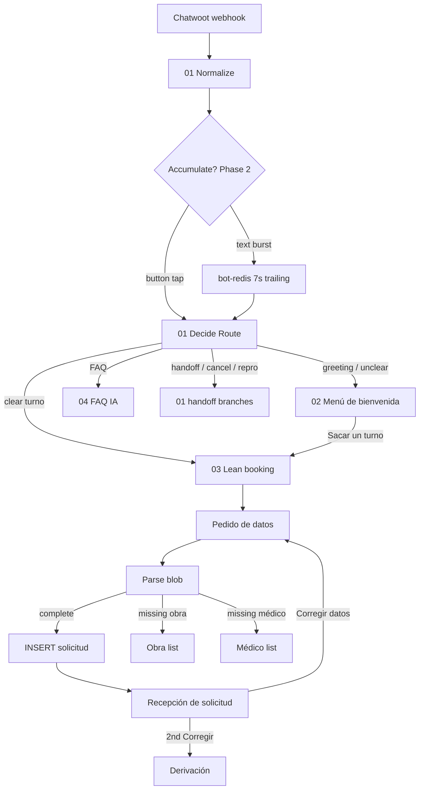

# Plan: Lean booking + message accumulation

**Status:** Phase 2 implemented in repo (live VPS: bot-redis + 01 import pending)  
**Goal:** Fewer outbound WhatsApp messages before Meta per-message billing (~Oct 2026), faster turno solicitado, clinic-familiar UX.  
**Domain terms:** `[CONTEXT.md](../CONTEXT.md)`  
**Decisions:** [ADR-0001](adr/0001-lean-booking-pedido-datos.md), [ADR-0002](adr/0002-message-accumulation-redis.md)

---

## Why


| Today (happy path)                                                         | Target (happy path)                                        |
| -------------------------------------------------------------------------- | ---------------------------------------------------------- |
| Menú → nombre → DNI → obra → médico → confirm → ack ≈ **6–7** bot outbound | **1–3** bot outbound                                       |
| Step machine asks one field per message                                    | **Pedido de datos** — one ask, patient replies in one blob |
| Separate confirm wizard                                                    | **Recepción de solicitud** — ack + datos + Corregir datos  |
| FAQ/horarios as extra taps                                                 | **Menú de bienvenida** embeds horario + ubicación          |


Rough Meta impact at clinic volume (after tightening): ~**$6–20/mo** vs test-week noise ~**$75–90/mo** (see handoff notes).

---


## Architecture (target)




**Phase 1** implements everything except the `ACC` / `bot-redis` box.  
**Phase 2** adds accumulation (ADR-0002).

---


## Locked product rules


| Topic                  | Rule                                                                                                       |
| ---------------------- | ---------------------------------------------------------------------------------------------------------- |
| Booking capture        | **Pedido de datos** — nombre, DNI, obra social, médico in one patient message                              |
| Pedido footer          | Active médicos + **médico de cabecera**; obra is free text in the blob                                     |
| Submit                 | Parse → **INSERT** → **Recepción** (no separate confirm step)                                              |
| Recepción              | “Recibimos tu solicitud…” + repeat all datos + **Corregir datos** button                                   |
| Corrección             | Re-Pedido → **UPDATE** same `turno_solicitudes` row → new Recepción; **once**; 2nd tap → **Derivación**    |
| Obra unclear           | One follow-up: today’s list (Particular + dashboard + Otras)                                               |
| Médico unclear         | Short message + WhatsApp **list** (not full Pedido again)                                                  |
| Parsing                | Regex/heuristics first; **OpenAI only on failure**                                                         |
| Menú                   | Body = horario de clínica + **ubicación** (address from `clinic_settings`); **only** Sacar un turno button |
| Skip menú              | Clear turno intent → straight to parse / Pedido / insert                                                   |
| Complete first message | If blob already complete (`quiero turno Juan…`) → skip Pedido → insert → Recepción                         |
| Partial blob           | One short “Falta: …” / invalid DNI; **do not** re-send full Pedido unless correction flow                  |
| Día/hora               | Still **Secretaría** — `horario_preferido` = “A confirmar por secretaría”                                  |
| Phone                  | WhatsApp number from Normalize — **no** phone question                                                     |
| Accumulation (Phase 2) | 7s after last fragment; space-join; buttons bypass; dedicated **bot-redis**                                |
| Live deploy **01**     | **Never** full-reimport (breaks Execute Workflow links) — paste Code nodes only                            |


---


## Message budget (bot outbound)


| Path                                      | Messages               |
| ----------------------------------------- | ---------------------- |
| Greeting only                             | 1 menú                 |
| Sacar turno + complete blob               | 1 Recepción            |
| Sacar turno + need Pedido + complete blob | 2 (Pedido + Recepción) |
| + unclear obra                            | +1 obra list           |
| + unclear médico                          | +1 médico list         |
| Clear turno + complete blob (no menú)     | 1 Recepción            |


---


## Conversation flows (Phase 1)


### A — Greeting → turno

```
Paciente: Hola
Bot:      [Menú] horarios + dirección + [Sacar un turno]

Paciente: [Sacar un turno]
Bot:      [Pedido de datos] + lista médicos en pie

Paciente: Juan Pérez 30111222 OSDE Dr Artigas
Bot:      [Recepción] datos + [Corregir datos]
          (+ private Ficha para Secretaría)
```


### B — Clear turno in one message

```
Paciente: Quiero turno Juan Pérez 30111222 particular Artigas
Bot:      [Recepción] (no menú, no Pedido)
```


### C — Corrección (once)

```
Paciente: [Corregir datos]
Bot:      [Pedido de datos] again

Paciente: Juan Pérez 30111222 OSDE Dr Esteban Artigas
Bot:      [Recepción] (UPDATE same solicitud)

Paciente: [Corregir datos] again
Bot:      Derivación → Secretaría
```


### D — Partial / follow-ups

```
Paciente: Juan 30111222          (missing obra + médico)
Bot:      Falta obra social y médico…

Paciente: OSDE                   (still missing médico)
Bot:      [médico WhatsApp list]

Paciente: [picks médico]
Bot:      [Recepción]
```

---


## Draft copy (Spanish — tune in implementation)


### Menú de bienvenida (02)

```
¡Hola! Bienvenido/a a la Clínica Oftalmológica Artigas.

🕘 Horarios: {clinic_hours}
📍 Ubicación: {address}

¿Necesitás un turno? Apretá el botón de abajo.
```

Button: **Sacar un turno** (`quiero_turno`)

### Pedido de datos (03)

```
Para solicitar el turno, enviá en un solo mensaje:
1. Nombre completo
2. DNI
3. Obra social (o Particular)
4. Médico de preferencia

Ejemplo: Juan Pérez 30111222 OSDE Dr. Adrian Artigas

Médicos: {lista activos}
• Mi médico de cabecera

La secretaria confirmará día y hora.
```


### Recepción de solicitud (03)

```
Recibimos tu solicitud de turno.

👤 {nombre}
🪪 {dni}
🏥 {obra_social}
🩺 {medico}
{price_line if applicable}

Espere a que la secretaria le indique el día y hora.
```

Button: **Corregir datos** (`corregir_datos`)

---


## State machine (03 — Phase 1)


| `conversation_state.state`  | Entered when                    | Next                        |
| --------------------------- | ------------------------------- | --------------------------- |
| `idle` / `menu_shown`       | Default / after menú            | Router or booking           |
| `awaiting_pedido_datos`     | Sacar turno or incomplete turno | Parse blob                  |
| `awaiting_obra_social`      | Obra missing/ambiguous          | Obra list handler (reuse)   |
| `awaiting_medico`           | Médico missing/ambiguous        | Médico list handler (reuse) |
| `awaiting_correccion_datos` | Corregir datos tapped           | Re-Pedido → UPDATE          |
| `post_solicitud`            | After Recepción                 | 2nd Corregir → Derivación   |


**Remove from happy path:** `awaiting_nombre`, `awaiting_dni`, `awaiting_telefono`, `awaiting_confirmacion` (keep code paths temporarily or delete after cutover).

**Context JSON keys (add/keep):** `nombre`, `dni`, `obra_social`, `medico`, `telefono_contacto`, `solicitud_id`, `correction_count`

---


## Implementation phases


### Phase 1 — Lean booking (start here)


| Step | Work                                                               | Files                                                                       |
| ---- | ------------------------------------------------------------------ | --------------------------------------------------------------------------- |
| 1.1  | `parsePedidoDatos()` + unit tests                                  | `scripts/parse-pedido-datos.js`, `scripts/test-parse-pedido-datos.js`       |
| 1.2  | Menú: load hours + address; one button                             | `n8n/workflows/02-welcome-menu.json`                                        |
| 1.3  | Replace 03 step chain with Pedido / parse / Recepción / correction | `n8n/workflows/03-booking-flow.json`                                        |
| 1.4  | Router: skip menú, `corregir_datos`, complete blob → booking       | `n8n/workflows/01-entry-router.json` (`Decide Route`, `Normalize` titleMap) |
| 1.5  | Update tests                                                       | `scripts/test-decide-route.js`, `scripts/test-booking-messages.js`          |
| 1.6  | Deploy notes + behaviour checklist                                 | `n8n/workflows/IMPORT.md`                                                   |
| 1.7  | Live paste on VPS (test phone)                                     | Human steps per IMPORT.md                                                   |


**Phase 1 exit criteria**

- [ ] Happy path ≤ 2 bot messages (Pedido + Recepción)
- [ ] Complete blob in one message → 1 Recepción
- [ ] Corregir updates same row once; 2nd → Derivación
- [ ] Obra/médico follow-ups only when needed
- [ ] Cancel/reprogram/handoff/FAQ unchanged or regression-tested
- [ ] `node scripts/test-*.js` green


### Phase 2 — Acumulación de mensajes (after Phase 1 stable)


| Step | Work                                                 | Files                                 |
| ---- | ---------------------------------------------------- | ------------------------------------- |
| 2.0  | Webhook **Respond Immediately** (`onReceived`)       | `01-entry-router.json`                |
| 2.1  | `bot-redis` service + env on n8n                     | `docker-compose.yml`, `.env.example`  |
| 2.2  | Accumulation branch (RPUSH, Wait 7s, flush)          | `01-entry-router.json`, `scripts/patch-01-accumulation.py` |
| 2.3  | Bypass rules for `boton_id` / interactive            | `scripts/acc-gate.js`                 |
| 2.4  | Unit + wiring tests                                  | `scripts/test-acc-gate.js`, `scripts/test-accumulation-wiring.js` |
| 2.5  | Deploy notes                                         | `n8n/workflows/IMPORT.md`             |
| 2.6  | Live: compose up bot-redis, Bot Redis credential, re-import 01 | Human |


**Phase 2 exit criteria**

- [x] Repo: bot-redis + Acc nodes + tests green
- [ ] Burst “Juan” / “Pérez” / “30111222 OSDE Artigas” → one merged parse
- [ ] Sacar un turno tap → instant (no 7s wait)
- [ ] No Chatwoot “agent bot error” on burst
- [ ] No duplicate solicitudes from webhook retries

---


## File map


| Area      | Path                                 |
| --------- | ------------------------------------ |
| Router    | `n8n/workflows/01-entry-router.json` |
| Menú      | `n8n/workflows/02-welcome-menu.json` |
| Booking   | `n8n/workflows/03-booking-flow.json` |
| FAQ       | `n8n/workflows/04-faq-ia.json`       |
| Deploy    | `n8n/workflows/IMPORT.md`            |
| Glossary  | `CONTEXT.md`                         |
| Wipe test | `mysql/wipe_test_data.sql`           |


---


## Risks and mitigations


| Risk                     | Mitigation                                                  |
| ------------------------ | ----------------------------------------------------------- |
| Wrong parse (DNI/médico) | Recepción shows datos; one Corregir; then Secretaría        |
| Full-reimport 01 on live | IMPORT.md + paste-only rule                                 |
| Chatwoot 5s timeout      | Webhook respond Immediately before any Wait (Phase 2)       |
| FAQ path ~4.3s today     | Lean booking removes steps; avoid extra LLM on booking path |
| Parser gaps              | Obra list / médico list fallbacks                           |


---


## Test plan (manual — one test phone)

1. `hola` → menú with hours + address, single button
2. Sacar turno → Pedido with médicos in footer
3. Full blob → Recepción + private note + dashboard solicitud
4. `quiero turno …` (complete) → skip menú, 1 Recepción
5. Partial blob → “Falta…” only
6. Unclear obra → obra list once
7. Unclear médico → list once
8. Corregir → UPDATE → Recepción
9. Corregir again → Derivación
10. Cancel / reprogram / estudio / FAQ / audio — no regression

---


## Out of scope (this plan)

- Secretary canned replies / Meta pass-through contract  
- Maps pin (link-only if added to FAQ later)  
- Native Meta API bypass of Chatwoot  
- Auto día/hora from agenda (still human-confirmed)

---


## Next action

**Live Phase 2:** `docker compose up -d bot-redis n8n`, create **Bot Redis** credential, re-import **01**, re-link 02/03/04, soak-test a 3-fragment burst.